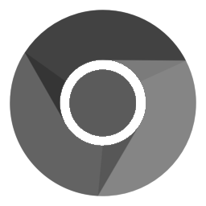
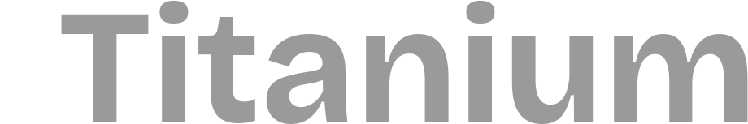

  

**Work in progress — not ready for use**

Instead of grinding leetcode, I made a browser. Now im unemployed.

## Why Titanium?

There's tons of browsers out there... so why this one? Jumping on from the philosophies posed in [Cromite](https://github.com/uazo/cromite) & [Ungoogled Chromium](https://github.com/ungoogled-software/ungoogled-chromium), I wanted to create something that intertwines the privacy goals of both the aftermentioned browsers, while allowing for a rich customized experience that you can curate from scratch. I also wanted to allow users to be able to own their own data without having to connect to a backend cloud service in order to do so; thus I created Titanium.

## Downloads

Wow. Such empty.

No releases yet, still in development; until then you can build from source!

## Want to build?

See [docs/REBUILD.md](docs/REBUILD.md) for reference.

## Credits
- [The Chromium Project](https://www.chromium.org/)
- [ungoogled-chromium](https://github.com/ungoogled-software/ungoogled-chromium)
- [Helium](https://github.com/imputnet/helium)
- [Brave](https://github.com/brave/brave-core)
- [Cromite](https://github.com/uazo/cromite)
- [go-sync](https://github.com/luxzg/go-sync)

## License

All content and patches from other projects maintain their own licensing; content unique to Titanium is licensed under GPL-3.0. See [LICENSE](LICENSE).
